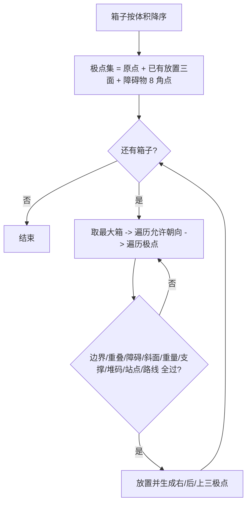
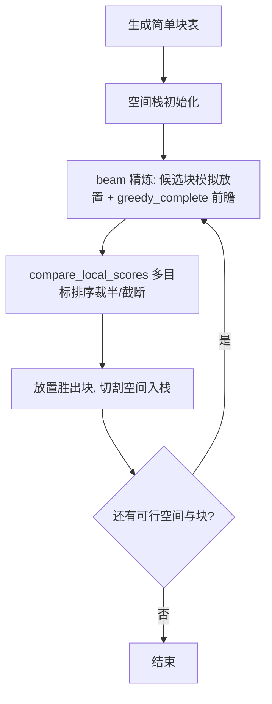
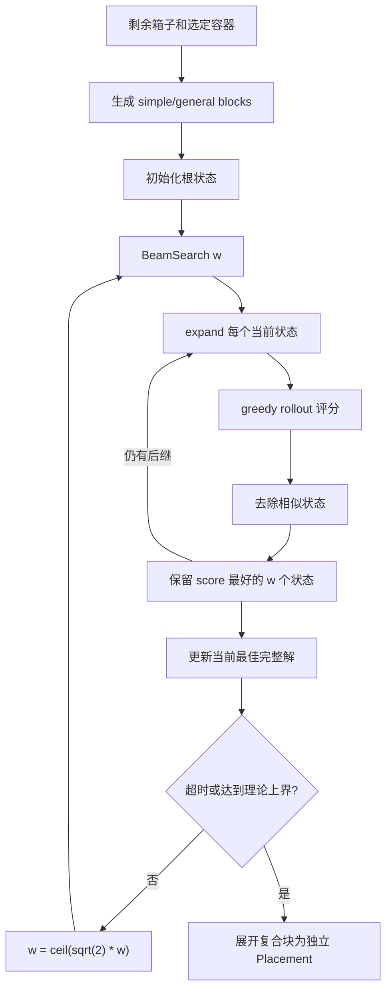

# 算法（Algorithms）

> 本文只讲四种算法的**单容器装载核心**——`PackerBase::pack_single()` 的职责：给定一个容器和一批待装箱子，决定如何摆放。多容器选车调度、装托流水线、续装调度、共享后处理等整体流程见 [architecture.md](architecture.md)。四种算法通过 `make_packer()` 按 `problem.algorithm` 选择，统一接入 `PackerBase::pack()` 模板方法，只实现各自的 `pack_single()`。
>
> 硬约束实现集中在 `constraints.hpp`（见 [constraints.md](constraints.md)），四种算法在放置检查点复用同一批纯函数，差异只在**检查粒度**（单箱 vs 逐叶）与性能门控。

## 总览

### 对比

| 维度     | GEP                    | GLC                              | RGS                                     | BSG                    |
| -------- | ---------------------- | -------------------------------- | --------------------------------------- | ---------------------- |
| 核心策略 | 体积降序 + EP 优先填充 | 块装载 + beam 搜索 + 前瞻评估    | EP-first-fit + 多策略排序 + Shaw 随机化 | 束搜索 + KPA 块合并    |
| 搜索粒度 | 单箱级                 | 块级（多箱一次放置）             | 单箱级                                  | 块级（多箱一次放置）   |
| 多样性   | 无（确定性单解）       | beam 多路保留                    | 多起点采样（5 策略 × M 迭代）           | 递增 beam 宽度         |
| 复杂度   | O(n·p)，n=箱子，p=极点 | 较高（beam 展开 + 前瞻评估）     | O(M·n·e)，M=迭代数，e=EP 数             | 高（beam 展开 + 块表） |
| 适用场景 | 通用、快速、简单场景   | 填充率要求高、可接受更长计算时间 | 多箱型场景，需要探索多样化布局          | 单容器填充率极高场景   |

### 约束检查粒度

| 算法      | 检查点       | 说明                                                                                       |
| --------- | ------------ | ------------------------------------------------------------------------------------------ |
| GEP / RGS | 单箱         | 逐箱调用共享约束函数                                                                       |
| GLC       | 块内逐箱模拟 | 块放置前对整个块逐箱模拟检查                                                               |
| BSG       | 复合块逐叶   | `can_place_block` 递归展开叶子逐箱检查；无约束且无 facets 场景走块级 `is_supported` 快路径 |

承重状态（`stack_level` / `supported_load`）由共享的 `check_stack_constraints` / `apply_stack_state` / `recompute_stack_state` 维护（机制见 [architecture.md](architecture.md) §6）。GEP/GLC/RGS 自底向上放置，用增量预检 + apply；BSG 通块可能带 z 间隙（先放悬空箱再放下方箱），逐叶增量会漏判，放置后整体 `recompute_stack_state` 校验。

---

## 1. GEP 极点贪心法

> 定位：实现最简单、速度最快的确定性贪心，作为默认算法。

### 核心思想

箱子按体积降序排序，维护候选**极点**（Extreme Point）集合（初始为原点）。逐个箱子遍历允许朝向与极点，第一个能放下（通过全部约束检查）的位置即放，放置后从箱子的右、后、上三面生成 3 个新极点。

### 代码地图

| 文件                                | 责任                                  |
| ----------------------------------- | ------------------------------------- |
| `src/core/algorithm/gep/packer.cpp` | `GepPacker::pack_single()` 单容器填充 |

### 算法流程



### 关键机制

- **极点生成**：放置后插入 `(x+dx, y, z)`、`(x, y+dy, z)`、`(x, y, z+dz)` 三个极点，极点集合按 (z,y,x) 有序去重。
- **障碍物角点**：初始化时把每个障碍物的 8 角点（4 顶角可上到顶面、4 底角可贴侧）加入极点集，保证障碍物周边可达。
- **tender 预检**：tender 约束与位置无关，先于朝向/极点循环判断，被拒则跳过该箱（保持未装箱）。

### 约束集成

边界、重叠、障碍物、斜面、重量、支撑率、堆码层数、单箱承重、站点限制、路线顺序、tender——全部逐箱调用 `constraints.hpp` 共享函数。

### 已有放置（续装）

`pack_single(items, ct, existing)` 先把已有放置 `prefill_load` 进装载状态，再从每个已有放置的三面生成初始极点（外加原点兜底）。极点是增量计算的，续装实现最直接。

### 参数

无算法专属参数（沿用 `src/core/algorithm/config.hpp` 编译期常量）。

### 难点与易错点

- 极点集合可能膨胀（每箱 +3），复杂度 O(n·p)；对超多箱子场景可考虑极点去重/精简，当前靠有序 `set` 去重控制。
- 首 fit 顺序（朝向->极点）影响结果；体积降序是保证填充率的关键，勿随意改动排序。

---

## 2. GLC 贪心前瞻构造

> 来源：求解三维装箱问题的多层启发式搜索算法. 计算机学报, 2012, 35(12):2553–2561（MLHS）
>
> 定位：块装载 + beam 多路保留 + 受限深度前瞻，填充率导向。

### 核心思想

将同种箱子 + 同朝向堆叠成**简单块**（nx×ny×nz 致密长方体）作为基本投放单元，在**空间栈**上放置。每步用 **beam 精炼**：对候选块模拟放置后用贪心完成（`greedy_complete`）评估最终状态作为 fitness，多目标比较后裁半/截断，取胜出块放置。

### 代码地图

| 文件                                   | 责任                                        |
| -------------------------------------- | ------------------------------------------- |
| `src/core/algorithm/glc/packer.cpp`    | 调度层适配（`PackerBase` 虚函数）           |
| `src/core/algorithm/glc/heuristic.cpp` | 容器内块装载（简单块生成、beam 精炼、前瞻） |
| `src/core/algorithm/glc/block.hpp`     | `SimpleBlock` 块定义                        |
| `src/core/algorithm/glc/space.hpp`     | `Space` / `SpaceKind`、空间栈与切割         |

### 算法流程



### 关键机制

- **简单块**：同箱型同朝向的 nx×ny×nz 致密长方体；块内所有箱子的 platform、group 必须一致。仅实现简单块，未做论文的复合块（复杂约束下复合块生成/评估成本高，简单块已够用）。
- **空间栈**：放置一个块后，未填充空间确定性切成至多 3 个子空间（上方、右方、后方）入栈。`parent_id` 追踪来源，支持 `TransferSpace` 碎片回收——栈顶无可行块时尝试合并给同次划分的兄弟空间。
- **障碍物雕刻**：初始空间用 6-slab 完整分解挖掉障碍物，保证周边空间可达。**斜面不雕刻**——阶梯碎片会切碎空间栈、降低装载，楔形禁区由 `check_block_feasible` 的 `check_facet` 逐箱兜底（过挖为 0）；**例外**：某斜面禁区覆盖原点（两负截距）时对贴角楔形做阶梯雕刻，否则初始空间 min corner 在禁区、块全部被拒而零装载。
- **beam 精炼**（`pack_beam`）：每步对候选块做多轮精炼——模拟放置 + 贪心完成评估 + 多目标排序，裁半保留。前瞻分两级：`greedy_complete` 对前几个候选做一步前瞻选最优（`pick_best_block`，eval_width=4）；`complete_largest` 纯贪心填到底，用于最终得分。
- **多目标评分**：`compare_local_scores` 按 (站点数, 体积率, 组数, 箱数) 字典序比较候选——站点聚拢优先，其次体积利用。

### 约束集成

块放置时**逐箱模拟**检查：边界、重叠、障碍物、斜面、重量、支撑率、站点限制、路线顺序、堆码层数、单箱承重、tender。全部复用 `constraints.hpp` 纯函数。

### 已有放置（续装）

GLC 的核心难点：已有放置可能不在任何 Space 的角落，无法直接 `split_space`。`reconstruct_spaces()` 分两路：

1. **角落匹配（快路径）**：已有放置按 (z,y,x) 升序，对每个放置从栈顶向下找位置和尺寸匹配的 Space，命中走标准 `split_space`。
2. **6-slab 完整分解（兜底）**：放置不在任何 Space 角落时，用 `carve_out_space()` 从包含它的 Space 中挖掉该区域——6-slab 完整覆盖（左/右/前/后/下/上），不丢对角空间，小块栈顶优先。

### 参数

| 参数       |     值 | 作用         |
| ---------- | -----: | ------------ |
| eval_width |      4 | 前瞻候选宽度 |
| 空间栈上限 | 编译期 | 栈容量限制   |

（其余如 beam 宽度等见 `src/core/algorithm/config.hpp`。）

### 难点与易错点

- **空间切割必须完整覆盖**：初始/续装挖空用 6-slab 完整分解，不能用十字形启发式切割——会丢对角空间（历史 bug，已回归测试保护）。
- 块内 platform/group 一致性：不一致会破坏站点/组约束，生成块时即过滤。
- beam 精炼的 fitness 依赖 `greedy_complete` 的质量，改动贪心完成策略会影响最终选块。

---

## 3. RGS 随机贪心搜索

> 来源：Heßler, Hintsch, Wienkamp. _A Fast Optimization Approach For A Complex Real-Life 3D Multiple Bin Size Bin Packing Problem_. arXiv:2410.01445v1, 2024（论文 §4 插入启发式、§5 RGS 框架、§6 多 ULD 策略）
>
> 定位：构造式搜索——每次用不同顺序构造解，多起点采样后择优。非局部搜索，不需要邻域算子。

**本实现的简化**：不做论文的斜面 ULD、边缘禁放、底托、垫料、重心优化（§5.1 的 CoG 平衡）、§5.2 的后处理（把箱子组向 ULD 中心移动以消除空洞）、倾斜物品；仅保留长方体容器 + 支撑/堆叠/重量/站点/路线约束。多 ULD 装载不实现论文 §6 的"必选 ULD"启发式选车，统一使用共享的 `select_largest_fitting` 大优先选车（见 [architecture.md](architecture.md) §2）。

### 核心思想

单次插入用 first-fit 贪心（EP 极点），通过**多策略排序 + Shaw 随机化**产生多样化布局，**多起点采样**后按字典序评分择优。

### 代码地图

| 文件                                | 责任                                        |
| ----------------------------------- | ------------------------------------------- |
| `src/core/algorithm/rgs/packer.cpp` | `RgsPacker::pack_single()`：策略×迭代主循环 |
| `src/core/algorithm/rgs/order.cpp`  | `build_ordered_list` 排序 + Shaw 随机化     |
| `src/core/algorithm/rgs/insert.cpp` | `insertion_heuristic` EP 插入 + 四道门检查  |
| `src/core/algorithm/rgs/grid.cpp`   | 3D 网格加速碰撞检测                         |
| `src/core/algorithm/rgs/state.cpp`  | `EpContext` 状态                            |

### 算法流程

```mermaid
flowchart TD
  A[5 种排序策略 × M 次迭代] --> B{ρ=0 首次确定性, 之后 ρ=0.5}
  B --> C[build_ordered_list 排序 + Shaw 扰动]
  C --> D[insertion_heuristic: EP first-fit]
  D --> E[评分 (体积率, 剩余站点数) 字典序]
  E --> F{更优?}
  F -->|是| G[更新 best]
  F -->|否| A
```

### 关键机制

- **排序策略**（论文 §4.2）：

  | 策略                        | 含义                    | 特点              |
  | --------------------------- | ----------------------- | ----------------- |
  | StackabilityCumulatedVolume | 可堆叠优先 + 按总体积   | 论文最强 baseline |
  | StackabilityHighestVolume   | 可堆叠优先 + 按最大单件 | 也稳定            |
  | CumulatedVolume             | 按总体积                | 偏利用率          |
  | HighestVolume               | 按最大单件              | 先放大件          |
  | Random                      | 完全随机                | 救极少数死局      |

  相同箱型归入 IdenticalGroup；按论文 §4.2.1 对**每个 (可达高度 h, 可堆叠性 ϑ)** 建一个 SimilarGroup——某箱型可达几个高度就入几个组，组内朝向锁定为该高度（§4.2.3：展开时只保留 `dz == h` 的朝向），因此加载序列中每箱最多出现 3 次（每个可达高度一次）：首次装入后其余出现由 `loaded_ids` 跳过，装不下的在后续高度重试。组间按策略排序，组内按体积降序。可堆叠（ϑ=1）= 存在某朝向允许其上方放箱：`max_stack` 未设或 ≥2 且 `max_load` 未设或 >0。`Stackability*` 两策略按**可堆叠优先（ϑ=1 在前）+ 体积**字典序排序，随机化阶段对可堆叠/不可堆叠两段**分别** Shaw（保持可堆叠箱严格优先于不可堆叠箱，论文 §4.2.2）。

- **路线顺序**：`route` 存在时，每个策略的**确定性 pass（ρ=0）**追加一趟稳定排序，按站点 route 深度（索引越大越深处）降序——深处站点先放、占满 X 小侧；**Shaw 迭代（ρ>0）保持各策略原排序**，配合硬门 `check_route_order` 输出恒合法。这条多样性是平台合并/最少站点等场景稳定通过的关键，因此无需独立路线策略。
- **Shaw 随机化**：`第 j 个位置 = ceil(y_j^(1/ρ) × (n − j + 1))`；ρ->0 接近原序，ρ=0.5 中等扰动，ρ=1 完全随机。每次调用用原子计数器生成不同种子。
- **插入启发式（Alg1/3/4）**：EP first-fit，**四道门**——边界 -> 网格碰撞（含障碍物/斜面检查）-> 支撑/堆叠性 -> 重量/站点/路线。
- **障碍物角点**：初始化时把每个障碍物的 8 角点（4 顶角可上到顶面、4 底角可贴侧）加入极点集（同 GEP），保证障碍物周边可达。
- **EP 生成（Alg3/4）**：每次放置后对每个投影方向 j 和每个第二方向 d2≠j 生成种子 `p_j = pos[j]+size[j]`、`p_d2 = pos[d2]+size[d2]`，沿 d2 向 −d2 投影找第一个未被阴影遮挡的已放物品后表面为 EP（无则取箱壁）；另在顶部中心 `(pos.x, pos.y, pos.z+dz)` 无条件加一个 EP（能否堆叠由 `can_place` 判定）。
- **网格加速**：以所有箱子平均边长为 cell_size，已放物品注册到 3D 网格，碰撞只查候选位置覆盖的单元。
- **评分**：`(volume_rate, remaining_platforms)` 字典序——体积率优先，并列时剩余站点数更少者优（倾向站点聚拢，降低后处理救不回的拆分概率）。

### 约束集成

逐箱调用共享约束（四道门中的第四道集中处理重量/站点/路线，支撑/堆叠在第三道）。

### 已有放置（续装）

共享的 `prefill_load()` 预填充 `ContainerLoad`（placements、volume、weight、platforms、groups），`prefill_ep()` 预填充 `EpContext`（从每个已有放置三面生成极点，外加原点）。每轮迭代在已有极点和放置基础上增量搜索；`best_load` 跨迭代比较时每个迭代独立预填充，最终包含已有+新增的完整状态。

### 参数

| 参数       |  值 | 作用                                |
| ---------- | --: | ----------------------------------- |
| Mmin       |  10 | 总迭代下限                          |
| Mmax       | 500 | 总迭代上限                          |
| 每策略下限 |   2 | 每策略最低迭代（含 1 次确定性 ρ=0） |
| ρ          | 0.5 | Shaw 扰动强度                       |

### 难点与易错点

- **`s_call_id` 红线**：进程级静态原子计数，每次求解调用递增，参与随机种子。任何无 pallet_types 分支的**零新增求解调用**约束都不能打破（新增 pack_single 调用会改变 RGS 行为、扰动既有测试确定性）。
- **网格注册完整性**：`insertion_heuristic` 开头必须把已有放置逐条注册进碰撞网格，否则旧箱查不到、可能重叠（历史 bug，tender 功能落地时修复）。
- 续装 `stop_when_complete` 完成判定必须是 `existing.size() + items.size()`（`load.placements` 含已有放置），否则后处理合并会被错误拒绝。

---

## 4. BSG 束搜索

> 来源：Araya, Riff. _A beam search approach to the container loading problem_. Computers & Operations Research, 2014
>
> 定位：块构造束搜索，单容器高填充率导向。

### 核心思想

先为每种箱型和允许朝向枚举**简单块**，再迭代合并成**通用块**（允许少量外包空隙，`max_fr` 门槛筛选）；随后在 **overlapping cover 残余空间**上做**递增宽度的束搜索**：每层展开候选后继、贪心 rollout 评分、去相似状态、保留最优 w 个，用 **KPA** 估计上界/评分。

### 代码地图

| 文件                                     | 责任                                                                          |
| ---------------------------------------- | ----------------------------------------------------------------------------- |
| `src/core/algorithm/bsg/packer.cpp`      | 从 `Problem` 构造单容器 BSG 上下文并调用求解器                                |
| `src/core/algorithm/bsg/solver.cpp`      | 外层 double search effort，展开最终复合块                                     |
| `src/core/algorithm/bsg/beam.cpp`        | 单次 beam search、贪心评估、相似状态过滤                                      |
| `src/core/algorithm/bsg/expand.cpp`      | 根据一个部分解生成候选后继                                                    |
| `src/core/algorithm/bsg/greedy.cpp`      | 对部分解贪心完成，用于 beam 状态评分                                          |
| `src/core/algorithm/bsg/block.cpp`       | 简单块和通用块生成、复合块合并树                                              |
| `src/core/algorithm/bsg/space.cpp`       | overlapping cover 剩余空间、anchor 选择、非极大空间删除                       |
| `src/core/algorithm/bsg/kpa.cpp`         | 三轴 KPA 与块评分 $f(b,r)$                                                    |
| `src/core/algorithm/bsg/support.cpp`     | `support_rate > 0` 时的支撑约束（快路径）                                     |
| `src/core/algorithm/bsg/feasibility.cpp` | 逐叶硬约束校验 `can_place_block`；堆码/承重放置后整体 `recompute_stack_state` |
| `src/core/algorithm/bsg/types.hpp`       | `BSGState`、`GeneralBlock`、`Cuboid`、`GlobalContext`                         |

### 算法流程



### 关键机制

- **状态**：`BSGState` 含残余空间 cover `R`（**允许重叠**）、剩余箱型计数、可构造块索引、已放置块、`used_volume`、三轴 KPA 表。`GeneralBlock` 保存外包尺寸 `osize`、内部箱子清单、真实箱体积 `single_box_volume` 和二叉合并树；求解结束递归展开合并树输出独立放置。
- **两个体积不能混用**：$V_{\text{box}}(b)$（真实装载体积，用于评分/统计）与 $V_{\text{bound}}(b)$（外包体积，仅表示占据空间）。允许空隙的通用块两者不等。
- **块预处理**：先枚举致密 simple block，再迭代合并（X/Y/Z 方向，外包取 max），最多 `max_bl` 个。合并要求外包不超容器、成员需求不超库存、填充率 ≥ `max_fr`。BR 分组：BR0–7（1–20 箱型）`max_fr=1.00`，BR8–15（30–100 箱型）`max_fr=0.98`。
- **障碍物雕刻**：初始空间/残差 cover 挖掉障碍物；`support_rate > 0` 时障碍物强制逐叶（快路径 `is_supported` 不认障碍物顶面支撑），`support_rate = 0` 时雕刻已保证空间无禁区、走快路径。**斜面不雕刻**——`facets` 存在即强制逐叶（`needs_leaf_validation`），由 `can_place_block` 的 `check_facet` 逐叶兜底（过挖为 0）；**例外**：某斜面禁区覆盖原点（两负截距）时对贴角楔形做阶梯雕刻，否则残余空间 anchor 落在原点会被拒而零装载。
- **残余空间**：overlapping cover，**不能改成互不重叠 partition**。一个块放入后，对所有与其重叠的残余 cuboid 各做 6-slab（左右前后下上）分解挖除，删除被完全包含的 non-maximal cuboid。互不重叠的碎片化表达会严重损害强异构实例。
- **anchor 与评分**：每个残余 cuboid 的 8 角与容器对应角算 Manhattan 距离，最小者为 anchor，优先 anchor 距离小的空间（并列取体积大者）。候选块用 $f(b,r)=V_{\text{box}}(b)-V_{\text{loss}}(b,r)$ 排序，`V_loss` 由三轴 KPA 估计块边缘可继续填补的最大范围。KPA 对每件箱建模"至多选一个允许朝向尺寸"的多选背包——不能只取该轴最大尺寸，否则最大尺寸不适配而较小朝向可适配时会错误排除可用箱。
- **beam search**：根层最多扩展 $\min(w^2,|B|)$ 个块，后续层每状态最多 w 个；每个后继做一次 greedy rollout 评分；用 rollout 最终装入的箱型计数去相似状态（相似时保留已装体积更小者）；保留评分最高 w 个。外层从 w=1 开始，每次结束后 $w \leftarrow \lceil\sqrt{2}\,w\rceil$（相邻轮次搜索投入约翻倍），根层候选数自然限制并做 int 溢出保护。

### 约束集成

约束模式下 `can_place_block` 递归展开复合块为叶子箱，逐叶调用共享硬约束（边界、重叠、障碍物、斜面、重量、支撑、站点、路线、堆码、承重、tender）；`needs_leaf_validation()` 按需门控——存在重量/平台上限/路线/堆码/承重/tender 约束、斜面，或 `support_rate>0` 且有障碍物时走逐叶路径，否则走块级 `is_supported` 快路径。纯几何 BSG 单测（无约束上下文）仍走 `is_supported`。

### 已有放置（续装）

双层机制：

- **Solver 层**：从 `ctx.existing_placements` 读取已有放置，`update_residual_space` 从残差空间挖掉；累计 `s0.used_volume`（含已有体积，影响 beam 排名）；约束模式下推入 `s0.constraint_load` 供逐叶校验。
- **Packer 层**：先把 `existing` 预填进返回的 `ContainerLoad`（与其他算法一致），再把 solver 返回的 `pr.placements` 追加其后，回填循环仅遍历新增放置补 `platform`/`group`/`weight` 元数据。

### 参数

| 参数   |        值 | 作用                           |
| ------ | --------: | ------------------------------ |
| max_bl |    10,000 | 块表上限                       |
| max_fr | 1.00/0.98 | 通用块填充率门槛（按 BR 分组） |

beam 宽度由 double search effort 动态增长。

### 难点与易错点

- **`GeneralBlock::volume()` 不是装载体积**：排序/统计必须用 `single_box_volume`，混用会偏好带空洞的块。
- **合并块递归展开与外包尺寸一致**：复合块用 `source_left_id/source_right_id` 记录组合树（非不稳定 vector 下标）；X/Y/Z 右子块起点分别偏移左子块对应轴尺寸。
- **vector 扩容使块引用失效**：`generate_blocks()` 中不能在保存 `const auto& a = blocks[i]` 后立刻追加新块再继续用 a——先算完所有合并候选再追加。
- **KPA 的 1D 放松不可当作实际可行装载**：三轴 KPA 只用于启发式评分，三个轴的最大长度不能组合成保证可行的三维装载。

### 已修复问题（维护者）

| 问题                           | 症状                                             | 修复                                                                      |
| ------------------------------ | ------------------------------------------------ | ------------------------------------------------------------------------- |
| 复合块生成中 `vector` 引用失效 | 同一 BR 输入偶发 Windows 访问冲突 `0xC0000005`。 | 先计算 X/Y/Z 三个合并候选，再调用 `add_block()`，避免扩容后继续读取引用。 |
| 残余空间被误实现为 partition   | 强异构 BR15 利用率约 49%。                       | 恢复 overlapping cover 与 non-maximal 删除。                              |
| 通用块被错误限制为齐边满填     | `max_fr=0.98` 基本无效，强异构退化。             | 非拼接轴取最大值并由填充率筛选。                                          |
| KPA 只取最大允许轴向尺寸       | 允许旋转的箱子在较小朝向可放入时被判不可用。     | 使用每件箱子的允许轴向尺寸集合进行多选背包。                              |

这些修复使 BR15#1 在本机固定 30 秒测试中从约 48.87% 提升到约 79.27%。

### KPA 试验记录（维护者）

曾实现过候选块库存扣减后的精确 KPA（以 $C' = C - \mathrm{members}(b)$ 重建三轴 DP，允许恰好填满剩余长度），语义上避免候选块库存被重复用于预测，但显著增加每个 rollout 的 DP 数量，在三个强异构 BR15 固定 30 秒试验中均降低装载率 1~5%，已 reset。若重新尝试：作为可配置实验模式、限制每 state 候选数与缓存、以 BR8–15 全部 800 例组均值比较、同时记录每例耗时。

---

## 基准方法（BR）

`data/br/`（被 .gitignore）由 `data/convert_br.py` 从 `data/br-origin/` 生成，每个 BR 实例转换为数量限制为 1 的单容器输入。首次运行前先执行：

```powershell
python data/convert_br.py   # 生成 data/br/br00_001.json ~ br15_100.json
```

使用 Release 构建，单例命令：

```powershell
xmake f -m release
xmake run cli .\data\br\br15_001.json -a bsg -t 30
```

论文表 2 的可比基线为 BSG-CLP 的 30/150/500 秒列。只有在相同 BR 分组、无支撑约束、Release 构建和每组 100 例统计下，结果才有解释价值。
