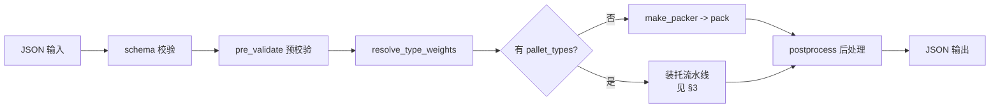
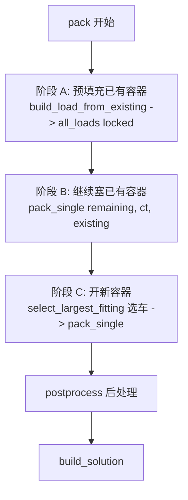
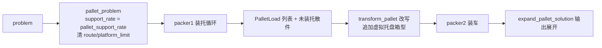

# 求解器架构

> 本文讲**整体架构与流程**：输入如何被解析校验、求解如何被调度、装托/续装两级流水线、共享后处理。输入/输出格式见 [input.md](input.md) / [output.md](output.md)，四种算法的单容器装载核心见 [algorithms.md](algorithms.md)，硬约束定义见 [constraints.md](constraints.md)。

## 1. 整体流程

统一入口 `app::run()`：



- **schema 校验**：编译时嵌入的 JSON Schema（`data/input_schema.json` -> `input_schema.h`），保证结构合法。
- **预校验**：`pre_validate_input()` 检查引用完整性、重量/group/platform 各自的三选一来源（只看 `box_types` 与待装 `boxes`）、已有快照的模式一致性、路线/站点、障碍物/斜面合法性，以及约束之间的**级联前提**（如 `max_stack`/`max_load`/装托要求 `support_rate > 0`、`tender_limit` 要求 `group`）。已有放置作为已解析快照：箱型级模式下可无值或重复同值，冲突即拒绝；箱子级模式下必须有值；无值模式下不得有值，缺失属性按箱型继承。
- **异常兜底**：任何未预见异常返回 `status=invalid`（带 `internal error`），任意输入都有完整 JSON 输出。

### 1.1 目标向量

目标不是加权和，而是固定字典序（优先级高的维度先比，打平才看下一维）：

1. `min_container_count` — 容器数最少
2. `min_platform_split` — 站点拆分次数最少
3. `max_volume_rate` — 体积利用率最高
4. `min_group_split` — 组拆分次数最少

站点/组优化部分在线进行（RGS/BSG 的评分倾向站点聚拢），其余通过统一共享后处理完成（见 §5）。

## 2. PackerBase 模板方法

`PackerBase::pack()` 是求解调度模板，四种算法实现底层虚函数 `pack_single_impl()`（单容器装载，见 [algorithms.md](algorithms.md)），由 `make_packer()` 按 `problem.algorithm` 选择。



- **选车**：`select_largest_fitting` 从可用容器类型中选能装下剩余箱子的最大车型（大优先）；`quantity_limit` 限制每种类型可用数量。四算法统一采用此策略，有意不实现来源论文的多 ULD 选车启发式（如 RGS 论文 arXiv:2410.01445 §6 的"必选 ULD"规则）。
- **单容器填充**：`pack_single(items, ct, existing, tender)` —— existing 为已有放置（续装时非空），tender 为已提交容器的运输委托分解。
- **逐平台分桶（route 存在时）**：`pack_single` 是封装层——route 存在时把待装箱子按**装货顺序（route 深度降序，最深平台先放）**分成平台桶，逐桶调用 `pack_single_impl`，每桶只放一个平台的箱子（严格分阶段），桶间仍走共享路线约束。`self_orders_platforms()` 为 true 的算法（RGS，其 `build_ordered_list` 已按深度优先排序）豁免分桶，避免拆散其时间预算驱动的迭代搜索。
- **主循环保护**：阶段 C 若 `packed.empty()` 立即 break（tender 拒绝是几何无关的，继续开空容器只会死循环到超时）。
- **时间限制**：`TimeChecker` 全局计时，主循环与算法内部双重检查。`time_limit` 为软限制：超时即返回当前最优并标记 `status=timeout`（即使已全部装完）；未超时且全部装完 -> `complete`，否则 -> `partial`。

## 3. 装托（Palletizing）

> 两级流水线：**散件（`loose:true`）-> 装托 -> 装车**；普通箱子直接散装上车。
> 核心思想：**托盘即装箱单元**。装托阶段把托盘当小容器，用与装车完全相同的算法与约束链（`pack_single`）把散件码上托盘；随后每个托盘改写成一个"不可再叠放、可 90° 平面旋转"的虚拟箱，交给现有求解器装车——**装车零改动**，路线/重量/支撑/tender/后处理等既有约束全部免费生效。

### 3.1 流程



### 3.2 输入与校验

| 配置       | 位置                              | 默认  | 说明                                                                                      |
| ---------- | --------------------------------- | ----- | ----------------------------------------------------------------------------------------- |
| 启用装托   | 顶层 `pallet_types`               | 无    | 任一存在即启用；`id`/`sx`/`sy`/`sz`/`payload`/`max_height` 必填，`self_weight` 默认 0     |
| 散件标记   | `box_types.loose`                 | false | true = 散件（装托）；false = 普通箱子（直接装车）                                         |
| 装托支撑率 | `constraints.pallet_support_rate` | 1.0   | 托盘上箱子底面支撑率下限（装托专用，与装车 `support_rate` 独立）                          |
| 装托兜底   | `constraints.pallet_fallback`     | false | 散件装不进任何托盘：false = 未装箱报错（partial）；true = 降级散装上车                    |
| 混合分组   | `constraints.pallet_mix_group`    | 无    | 装托模式必填；true 允许同一 platform 混合 group，false 保持 group 隔离，不允许跨 platform |

预校验：装托模式强制显式配置 `pallet_mix_group`、有重量信息、全部容器带 `payload`、装车 `support_rate > 0`；`loose: true` 但无 `pallet_types` -> `invalid`；有 `pallet_types` 但无散件 -> 等价普通装箱。

### 3.3 行为

- **装托**：每轮对所有托盘类型试装，按（体积, 箱数）取优；同 `platform+group` 优先整组独占一托，装不下的进入兜底池。`pallet_mix_group=false` 时兜底池仍按 `platform+group` 分桶；为 true 时按 `platform` 分桶，允许同一站点混合 group，但不允许跨站点。混合托盘保留完整 group 集合，托盘单元参与装车阶段的 group_split、tender 和路线约束。
- **装车**：托盘改写为虚拟箱——`max_stack=[1,1]`（其上不可放箱，单向不叠托）、仅 XY 平面 90° 旋转、重量含托盘自重；与普通箱子一起走现有求解器，主目标仍是用车数最少。
- **时间**：装托分走 `min(20%×time_limit, 15s)`，剩余归装车。

| 结果                                    | 情形                                  |
| --------------------------------------- | ------------------------------------- |
| `complete`                              | 全部散件装托 + 装车完成               |
| `partial` + violations "not palletized" | 有散件装不进任何托盘且 fallback=false |
| 降级散装进入装车阶段                    | 有散件装不进任何托盘且 fallback=true  |
| `partial`（该托盘未装箱）               | 托盘单元装不进任何车厢                |
| `timeout`（已装部分保留）               | 超时                                  |

### 3.4 输出

- `summary` 新增 `pallet_count` / `palletized_box_count` / `loose_box_count`；`packed_box_count` 保持散箱口径（托盘按内部箱数计）。
- `result.pallets`：每托含 `pallet_id` / `used_height` / `used_weight` / `volume_rate` / `groups` / `platforms` / `placements`；容器中托盘单元 `box_id` = `pallet_id`，可在 `pallets` 展开内部明细。
- 装不进托的散件（fallback=false）：`partial` + violations 说明。

### 3.5 实现关键点（维护者）

- **代码**：`pallet.hpp/cpp`（类型 io + 虚拟容器/箱型生成）、`palletizer.hpp/cpp`（装托循环 / 问题改写 / 输出展开）；入口 `app.cpp` 两级流水线；`io.cpp` 与 `input_schema.json` 负责解析/校验。
- **关键点**：
  1. 装托 packer 绑定 problem 副本：`support_rate = pallet_support_rate`，**清除 `route`/`platform_limit`**——否则小托盘内被强加车厢卸货顺序/站点数约束。
  2. 改写后**重建 `has_max_stack`/`has_max_load`**——虚拟箱自带 `max_stack`，解析时算出的标志不含它，"不叠托"会失效。
  3. `pack_single` 返回的 `load.type` 指向传入的临时容器，须在析构前消费。
  4. 无 `pallet_types` 分支**零新增求解调用**（RGS `s_call_id` 静态计数，防既有测试漂移）。

- **限制**：托盘数量上限未实现；托盘装不进车厢则该托未装箱。

## 4. 中间状态续装（Resume Packing）

从已有部分放置继续装箱——输入通过 `existing_containers` 描述已放置的容器和箱子，求解器在此基础上继续放置剩余箱子。

### 4.1 设计原理

- **已有放置不可移动**：`ContainerLoad::locked = true`，后处理跳过 locked 容器。
- **剩余箱子独立输入**：`boxes` 列表只列待装箱子，已放置箱子完全由 `existing_containers` 描述，两不相交。
- **输入输出格式对齐**：`existing_containers` 的 placement 字段与输出 placement 完全一致，上轮输出可直接 copy-paste 为下轮输入。

### 4.2 三阶段主循环

```
pack()
  ├─ 阶段 A: 预填充已有容器
  │   build_load_from_existing() -> all_loads（locked=true）
  ├─ 阶段 B: 继续塞已有容器
  │   for each cl in all_loads:
  │     extra = pack_single(remaining, ct, cl.placements)
  │     用 extra 覆盖 cl 的可变字段（volume/weight/platforms/groups）
  └─ 阶段 C: 开新容器
      pack_single(remaining, ct, {})  // existing 为空
```

阶段 B 将已有 `placements` 作为 `existing` 参数传入 `pack_single`，各算法基于已有空间占用搜索新箱子（各算法的"已有放置处理"见 [algorithms.md](algorithms.md) 对应章节）。新增箱子合并回原容器后，累计值直接用 `extra` 覆盖，避免逐 placement 重复累加。

### 4.3 预校验

`pre_validate_input()` 对已有容器做完整校验：容器/箱型存在性、`quantity_limit` 超限、重复 `box_id`、边界、重叠、支撑率、站点限制、路线顺序、重量上限（`total_weight` vs `payload`）、`size` 一致性（若提供 `dx/dy/dz` 必须与 type+朝向推导一致）。

### 4.4 与装托的组合

`existing_containers` 与装托可同时使用（已支持）——装托阶段只处理新散件（已有放置不参与装托），已有容器锁定不动，新散件装托后与普通箱一起续塞进已有容器剩余空间（或开新容器）。

### 4.5 后处理兼容

两个后处理步骤均跳过 locked 容器：`reduce_platform_splits` 不会从已有容器移动站点；`repack_last_smaller` 不会把已有容器换到更小车型（内部 `pack_single` 传空 `existing`，只涉及新容器）。

## 5. 共享后处理

`postprocess.cpp` 提供两个后处理阶段，所有算法共享，通过 `pack_single()` 回调重装：

1. **`repack_last_smaller`**：把最后一个容器尝试用更小容器类型重装（等价于 downsize）。
2. **`reduce_platform_splits`**：把分散在多个容器中的同站点箱子并入某个已有容器（不新增容器，优先并入剩余空间最大的尾车），减少站点拆分。合并 trial 先尝试把捐献箱插入目标现有布局，失败则重排整个目标容器（目标自身箱子 + 捐献箱一起重新装载，碎片化布局也能容纳）。

后处理在 `PackerBase::pack()` 末尾统一调用，目标必为非锁定容器（锁定容器已在候选排除）。

## 6. 共享数据结构优化

### Placement.osize

`Placement` 携带 `OrientedSize osize`（放置时预计算的朝向实际尺寸），约束函数直接使用，无需在检查时反复查箱型表：

- `check_overlap` 接收 `(pos, osize, existing)`，不依赖箱型表。
- `check_support` 的支撑矩形检测直接用 `pl.osize`。

### 承重约束状态（max_stack / max_load）

`BoxType` 的 `max_stack` / `max_load`（与 `allowed_orientations` 对齐的 optional 向量），任一箱型有非空值即启用（presence-based）：

- `Placement` 内部字段 `stack_level` / `same_run` / `cum_load` / `supports`（直接支撑下标，均不序列化到输出），由 `constraints.cpp` 的 `check_stack_constraints`（只读预检）、`apply_stack_state`（放置后副作用）、`recompute_stack_state`（任意顺序重建 + 校验，用于续装 / 后处理合并 / 预校验）维护。
- 堆叠状态沿**支撑链**（直接支撑 + 传递支撑）传播：max_stack 同型连续 run（`same_run`，异型不互计）、max_load 面积分摊（A3）+ 整柱累计（`cum_load`），语义与示例见 [constraints.md](constraints.md) 1.8 / 1.9。
- `support_rate` / `max_stack` / `max_load` 相互独立；`support_rate = 0` 时允许悬空放置，悬空箱不计入堆叠柱。预校验强制：声明 `max_stack`/`max_load` 或启用装托时 `support_rate` 必须 > 0。

### 其他

- `ContainerLoad::type` 只指向 `problem_.container_types`（生命周期覆盖整个求解过程），`ct_map` 与 `build_load_from_existing` 用 `const ContainerType*` 索引。
- 输出**字段恒存在**（未启用功能给 null/空数组/false），消费契约见 [output.md](output.md)。
