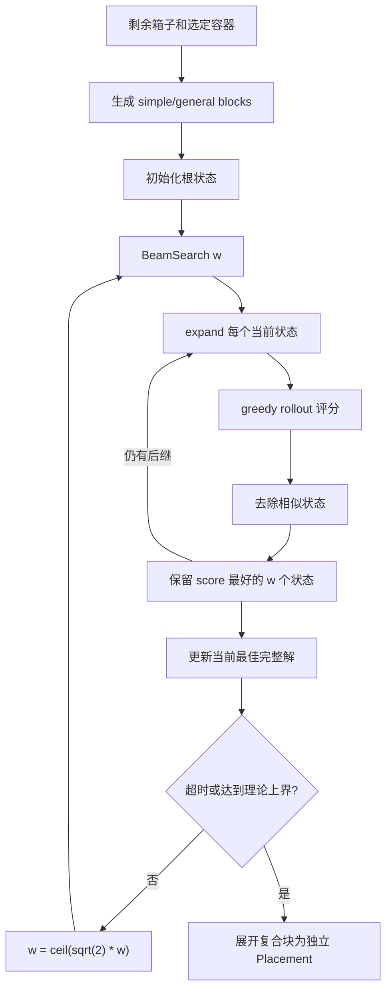

# BSG-CLP 束搜索

`BSG` 是本项目用于单容器三维装载的块构造束搜索，实现参考 Araya、Riff 的论文 _A beam search approach to the container loading problem_（Computers & Operations Research, 2014）。

它的原始目标是：在一个给定长方体容器内，在不重叠、满足方向约束的前提下最大化已装箱子总体积。项目通过 `PackerBase` 将它接入多容器调度和后处理；因此 BSG 的核心仍是单容器求解器，但最终结果还会经过统一的容器选择和后处理流程。

## 1. 代码地图

| 文件                                     | 责任                                                                                                   |
| ---------------------------------------- | ------------------------------------------------------------------------------------------------------ |
| `src/core/algorithm/bsg/packer.cpp`      | 从项目 `Problem` 构造单容器 BSG 上下文并调用求解器。                                                   |
| `src/core/algorithm/bsg/solver.cpp`      | 外层 double search effort，展开最终复合块。                                                            |
| `src/core/algorithm/bsg/beam.cpp`        | 单次 beam search、贪心评估、相似状态过滤。                                                             |
| `src/core/algorithm/bsg/expand.cpp`      | 根据一个部分解生成候选后继。                                                                           |
| `src/core/algorithm/bsg/greedy.cpp`      | 对部分解贪心完成，用于 beam 状态评分。                                                                 |
| `src/core/algorithm/bsg/block.cpp`       | 简单块和通用块生成、复合块合并树。                                                                     |
| `src/core/algorithm/bsg/space.cpp`       | overlapping cover 剩余空间、anchor 选择、非极大空间删除。                                              |
| `src/core/algorithm/bsg/kpa.cpp`         | 三轴 KPA 与块评分 $f(b,r)$。                                                                           |
| `src/core/algorithm/bsg/support.cpp`     | `support_rate > 0` 时的支撑约束（快路径）。                                                            |
| `src/core/algorithm/bsg/feasibility.cpp` | 逐叶硬约束校验 `can_place_block`；`max_stack` / `max_load` 在放置后整体 `recompute_stack_state` 校验。 |
| `src/core/algorithm/bsg/types.hpp`       | `BSGState`、`GeneralBlock`、`Cuboid` 和 `GlobalContext`。                                              |
| `tests/test_bsg.cpp`                     | BSG 单元与回归测试。                                                                                   |

## 2. 问题和状态

对单个容器 $\Gamma$，状态 `BSGState` 包含：

- `R`：残余空间的 cuboid cover；cuboid **允许重叠**。
- `remaining_counts`：每个箱型剩余件数。
- `available_blocks`：当前库存下仍可构造的全局块索引。
- `placements`：已经放置的块及其位置。
- `used_volume`：已装入箱子的真实总体积。
- `kpa_L/W/H`：基于当前剩余库存的三轴 KPA 表。

`GeneralBlock` 同时保存外包尺寸 `osize`、内部箱子清单 `members`、真实箱体积 `single_box_volume` 和二叉合并树。求解结束后，`solver.cpp` 递归展开合并树，输出独立箱子的实际位置和朝向。

这里有两个不能混淆的体积：

$$
V_{\text{box}}(b)=\texttt{single\_box\_volume},\qquad
V_{\text{bound}}(b)=\texttt{osize.volume()}.
$$

前者用于已装载体积和评分中的 $V(b)$，后者仅表示块占据的外包空间。对于允许少量空隙的通用块，两者不相等。

## 3. 整体流程



### 3.1 块预处理（K2）

`generate_blocks()` 先为每种箱型和允许朝向枚举致密 simple block，再迭代合并已有块，最多生成 `max_bl` 个块。

合并 X 方向两个块 $a,b$ 时，外包尺寸为：

$$
(l_a+l_b,\ \max(w_a,w_b),\ \max(h_a,h_b)).
$$

Y、Z 方向对称。合并后检查：

- 外包尺寸不超过容器；
- 每种成员箱子的需求不超过初始库存；
- 填充率不低于 `max_fr`：

$$
\mathrm{fill\_rate}(b)=\frac{V_{\text{box}}(b)}{V_{\text{bound}}(b)}\ge\texttt{max\_fr}.
$$

BR 基准的参数与论文实验分组对应：

| BR 分组   |  箱型数 | `max_fr` | 目的                                   |
| --------- | ------: | -------: | -------------------------------------- |
| BR0--BR7  |   1--20 |     1.00 | 仅允许满填块，接近 simple block 策略。 |
| BR8--BR15 | 30--100 |     0.98 | 允许通用块最多约 2% 外包空隙。         |

`max_bl` 为 10,000，定义于 `src/core/algorithm/config.hpp`。

### 3.2 残余空间（K1）

BSG 使用 **overlapping cover representation**，不能改成互不重叠的 partition。一个块放入某个残余 cuboid 后：

1. 对选中空间生成右、前、上方向的 cover cuboid；这些 cuboid 可以互相重叠。
2. 对其他与新块重叠的残余 cuboid，生成最多 6 个可重叠投影 cuboid。
3. 删除被其他 cuboid 完全包含的 non-maximal cuboid。

例如在 $100\times100\times100$ 空间原点放入 $50^3$ 块，必须保留：

$$
(50,0,0;50,100,100),\quad
(0,50,0;100,50,100),\quad
(0,0,50;100,100,50).
$$

三者两两重叠是预期行为。若改成三块不重叠碎片，会严重缩小后续可达空间，特别损害强异构实例。

### 3.3 空间、anchor 与块评分（K3--K5）

每个残余 cuboid 的 8 个角分别与容器的对应角计算 Manhattan 距离，距离最小的角为 anchor。优先选择 anchor 距离最小的残余空间；距离相同时选择体积更大的空间。块贴合所选 anchor 放置。

对于选中的残余空间 $r$，候选块使用：

$$
f(b,r)=V_{\text{box}}(b)-V_{\text{loss}}(b,r)
$$

排序。`V_loss` 用三轴 KPA 估计块边缘可继续填补的最大范围。KPA 对每件剩余箱子建模为“至多选一个允许朝向尺寸”的多选背包；不能只取该轴最大的允许尺寸，否则当最大尺寸不适配而较小朝向可适配时，会把可用箱子错误排除。

当前默认评分使用一次 state 级 KPA，符合论文“每个 state 只运行一次 KPA”的性能策略。详见 [KPA 试验](#7-kpa-试验与结论)。

### 3.4 Beam search（K6）

`beam_search()` 从根状态开始分层展开：

- 根层最多扩展 $\min(w^2, |B|)$ 个块；后续层每个状态最多扩展 $w$ 个块。
- 每个后继状态执行一次 greedy rollout，得到一个临时完整解体积作为评分。
- 使用 rollout 最终装入的箱型计数去除相似状态；相似时保留当前已装体积更小的状态。
- 保留评分最高的 $w$ 个状态进入下一层。

外层从 $w=1$ 开始，每次执行结束后增加：

$$
w\leftarrow\lceil\sqrt{2}\,w\rceil.
$$

这使相邻轮次的估算搜索投入约翻倍。根层由实际候选数自然限制，并对平方和下一轮增长做 `int` 溢出保护。

## 4. 约束和项目集成

BSG 继承项目的容器调度，并在块放置时逐叶校验共享硬约束，与 GEP/GLC/RGS 保持一致。

- 方向约束：由 `BoxType::allowed_orientations` 和块生成保证。
- 边界与重叠：在叶子箱展开后通过 `check_boundary` / `check_overlap` 校验。
- 重量约束：逐箱累加并通过 `check_weight` 对照容器 `max_weight` 校验。
- 支撑约束：`support_rate > 0` 时通过项目通用的 `check_support` 校验支撑面积占比和可堆叠性。
- 平台数量限制：通过 `check_platform_limit` 校验。
- 路线顺序约束：通过 `check_route_order` 按 Y/Z 重叠门控校验 X 轴通道。

约束校验仅在 `PackerBase` 传入项目约束时启用。纯几何 BSG 单元测试（无约束上下文）仍走原有的 `is_supported` 路径，不受影响。

BR 论文基准没有开启项目 `support_rate`，转换后的输入也保留原始容器尺寸、箱型数量和允许朝向。`data/convert_br.py` 将每个 BR 实例转换为数量限制为 1 的单容器输入。

## 5. 已验证的修复

| 问题                           | 症状                                             | 修复                                                                                     | 保护测试                                         |
| ------------------------------ | ------------------------------------------------ | ---------------------------------------------------------------------------------------- | ------------------------------------------------ |
| 复合块生成中 `vector` 引用失效 | 同一 BR 输入偶发 Windows 访问冲突 `0xC0000005`。 | 先计算 X/Y/Z 三个合并候选，再调用 `add_block()`，避免扩容后继续读取 `blocks[i/j]` 引用。 | 重复复合块生成。                                 |
| 残余空间被误实现为 partition   | 强异构 BR15 利用率约 49%。                       | 恢复 overlapping cover 与 non-maximal 删除。                                             | 根空间放块后三个重叠 cover 空间。                |
| 通用块被错误限制为齐边满填     | `max_fr=0.98` 基本无效，强异构退化。             | 非拼接轴取最大值并由填充率筛选。                                                         | 不等横截面、97.5% 填充率的 X 合并。              |
| KPA 只取最大允许轴向尺寸       | 某些允许旋转的箱子在较小朝向可放入时被判不可用。 | 使用每件箱子的允许轴向尺寸集合进行多选背包。                                             | 容量 80 时 $100\times50\times20$ 箱选择长度 50。 |

这些修复使 BR15#1 在本机固定 30 秒测试中从约 48.87% 提升到约 79.27%。这不是论文表格的可复现声明：论文报告的是每个 BR 组 100 个实例的平均值，并且使用了不同硬件与原始实现。

## 6. 难点与易错点

### 6.1 `GeneralBlock::volume()` 不是装载体积

`volume()` 是外包 cuboid 体积。排序、已装体积和结果统计中需要的是 `single_box_volume`。错误混用会偏好带空洞的块，尤其影响 `max_fr < 1.0` 的强异构实例。

### 6.2 合并块的递归展开必须与外包尺寸一致

复合块使用 `source_left_id/source_right_id` 记录组合树，而不是不稳定的 vector 下标。调整合并规则时必须同步检查 `solver.cpp` 的 `expand_block_placements()`：X/Y/Z 右子块起点分别要偏移左子块的 X/Y/Z 尺寸。

### 6.3 `std::vector` 扩容会使块引用失效

`generate_blocks()` 中不能在保存 `const auto& a = blocks[i]`、`b = blocks[j]` 后立刻追加新块，再继续使用 `a/b`。追加可能重分配 vector。先计算所有候选合并，再追加。

### 6.4 不要把 KPA 的 1D 放松当作实际可行装载

三轴 KPA 只用于启发式评分，三个轴分别求得的最大长度不能组合为一个保证可行的三维装载。它的作用是比较候选，而不是证明剩余空间能装多少体积。

## 7. KPA 试验与结论

曾实现过候选块库存扣减后的精确 KPA：对于候选块 $b$，以

$$
C' = C - \mathrm{members}(b)
$$

重新构建三轴 DP，并允许 KPA 使用恰好填满的剩余长度。这个版本在语义上避免候选块库存被重复用于预测未来填充，但会显著增加每个 rollout 的 DP 数量。

在三个强异构 BR15 固定 30 秒试验中，该版本均降低装载率1~5%，因此已被 reset，不是当前默认实现。后续若重新尝试，应满足以下条件：

1. 将精确 KPA 作为可配置实验模式，不改变默认 benchmark 行为。
2. 明确限制每个 state 的精确候选数和缓存大小。
3. 以 BR8--BR15 全部 800 个实例的组均值比较，不以单例决定取舍。
4. 同时记录每例实际耗时，避免评分更精确但 rollout 数骤减造成假性退化。

## 8. 基准方法

使用 Release 构建，单例命令如下：

```powershell
xmake f -m release
xmake run cli .\data\br\br15_001.json -a bsg -t 30
```

论文表 2 的可比基线为 BSG-CLP 的 30 秒、150 秒和 500 秒列。只有在相同 BR 分组、无支撑约束、Release 构建和每组 100 例统计下，结果才有解释价值。

## 9. 修改 BSG 前的检查表

- 修改 `space.cpp`：确认输出仍是 overlapping cover，并补充 maximal-space 回归测试。
- 修改 `block.cpp`：确认 `max_fr` 在 BR8--BR15 真正影响是否可合并，且复合块能递归展开。
- 修改 KPA：分别验证方向选择、库存数量和候选块自引用；先测吞吐再测组均值。
- 修改 beam 宽度：保留 $w^2$ 根扩展、double effort 和 `int` 溢出保护；不要因任意固定宽度提前结束。
- 修改去重：相似状态的定义会直接影响 diversity，必须用 BR 批量基准验证。
- 完成后运行：

```powershell
xmake run test "[bsg]"
xmake run test
```
